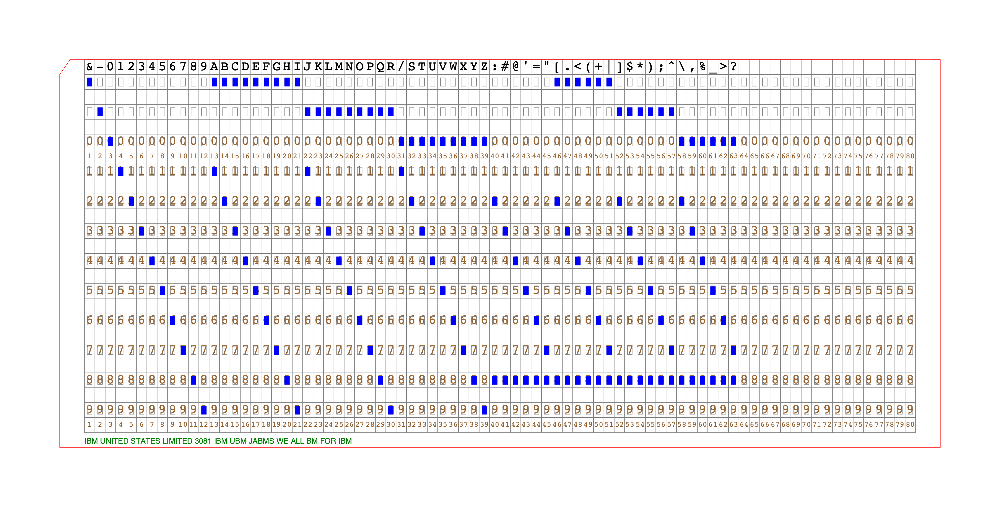

# Puncher

This is a utility that creates IBM 80-column punchcards as SVG files.  It takes a string and produces
a punchcard image in SVG suitable for cutting on a Circut or Sihouette cutting machine.

## Usage

    % puncher --help
    usage: puncher.py [-h] --out OUT [--form {svg,png}] (--cstring CSTRING | --testpattern) [+flatten] [-flatten] [+cellboundaries] [-cellboundaries] [+punchboundaries] [-punchboundaries] [+printpunch] [-printpunch]

    Punchcard creator utility

    This utility creates an image of an IBM 80-column punchcard, and in SVG output a version suitable
    to print using a cutting machine like a Cricut or Silhoutte Cameo.

    EXAMPLES:

    Generate the first line of a TLE and output both SVG and PNG forms to iss_tle_1.[png,svg]
    $ puncher --form svg --form png --out iss_tle_1 \
      --cstring "1 25544U 98067A   25324.86734766  .00014275  00000-0  26737-3 0  9990"

    Generate the first line of a TLE and output SVG to iss_tle_1.svg, flattening printed material to raster
    $ puncher --form svg --out iss_tle_1_flat +flatten \
      --cstring "1 25544U 98067A   25324.86734766  .00014275  00000-0  26737-3 0  9990"

    DEPENDENCIES:

    libcairo2 - puncher needs to be able to find libcairo2 on the library search path.

    options:
    -h, --help         show this help message and exit
    --out OUT          Output path stem, .svg or .png will be appended depending on --form setting
    --form {svg,png}   specify output file form(s) and extensions, options are PNG and SVG
    --cstring CSTRING  String to print on the card
    --testpattern      Print a test pattern
    +flatten           Do flatten printed material to a raster image
    -flatten           Don't Flatten printed material to a raster image
    +cellboundaries    Do print all the character cell boundaries
    -cellboundaries    Don't print all the character cell boundaries
    +punchboundaries   Do print all the punch hole location boundaries
    -punchboundaries   Don't print all the punch hole location boundaries
    +printpunch        Do print boxes for punch holes
    -printpunch        Don't print boxes for punch holes

## Building examples

    % cd examples
    examples % ./examples.sh
    [PUNCHER] creating punchcard with content: "ISS (ZARYA)", switches=-flatten,-cellboundaries,-punchboundaries,-printpunch 
    [PUNCHER] writing SVG to: iss_tle_0.svg
    [PUNCHER] writing PNG to: iss_tle_0.png
    [PUNCHER] creating punchcard with content: "ISS (ZARYA)", switches=+flatten,-cellboundaries,-punchboundaries,-printpunch 
    [PUNCHER] writing SVG to: iss_tle_0_flat.svg
    [PUNCHER] creating punchcard with content: "1 25544U 98067A   25324.86734766  .00014275  00000-0  26737-3 0  9990", switches=-flatten,-cellboundaries,-punchboundaries,-printpunch 
    [PUNCHER] writing SVG to: iss_tle_1.svg
    [PUNCHER] writing PNG to: iss_tle_1.png
    [PUNCHER] creating punchcard with content: "1 25544U 98067A   25324.86734766  .00014275  00000-0  26737-3 0  9990", switches=+flatten,-cellboundaries,-punchboundaries,-printpunch 
    [PUNCHER] writing SVG to: iss_tle_1_flat.svg
    [PUNCHER] creating punchcard with content: "2 25544  51.6324 250.7347 0003961 150.1460 209.9755 15.48935269539463", switches=-flatten,-cellboundaries,-punchboundaries,-printpunch 
    [PUNCHER] writing SVG to: iss_tle_2.svg
    [PUNCHER] writing PNG to: iss_tle_2.png
    [PUNCHER] creating punchcard with content: "2 25544  51.6324 250.7347 0003961 150.1460 209.9755 15.48935269539463", switches=+flatten,-cellboundaries,-punchboundaries,-printpunch 
    [PUNCHER] writing SVG to: iss_tle_2_flat.svg
    [PUNCHER] creating punchcard with content: "&-0123456789ABCDEFGHIJKLMNOPQR/STUVWXYZ:#@'="[.<(+|]$*);^\,%_>?", switches=-flatten,+cellboundaries,+punchboundaries,+printpunch 
    [PUNCHER] writing SVG to: charset.svg
    [PUNCHER] writing PNG to: charset.png
    [PUNCHER] creating punchcard with content: "&-0123456789ABCDEFGHIJKLMNOPQR/STUVWXYZ:#@'="[.<(+|]$*);^\,%_>?", switches=+flatten,+cellboundaries,+punchboundaries,+printpunch 
    [PUNCHER] writing SVG to: charset_flat.svg`

## Development

Getting started
    git clone git@github.com:andersojs/puncher.git
    cd puncher
    uv sync
    uv pip install -e .
    uv run python -m puncher

Build sdist and wheel packages (into `dist/`)

    uv build

Install editable version for active development

    uv pip install -e .
