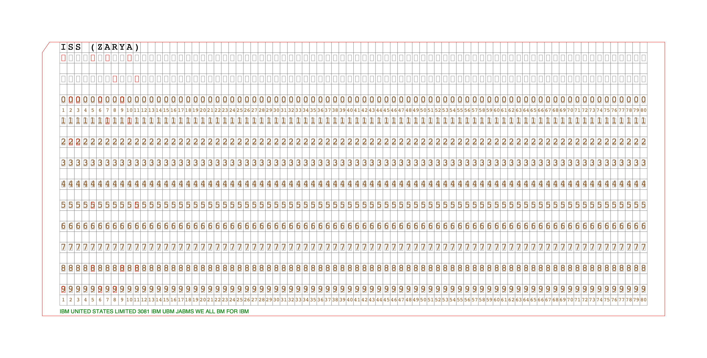
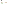
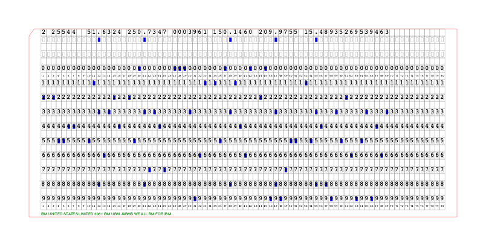

# Some simple examples

## ISS TLE

The 3LE for ISS looks like:

    ISS (ZARYA)
    1 25544U 98067A   25324.86734766  .00014275  00000-0  26737-3 0  9990
    2 25544  51.6324 250.7347 0003961 150.1460 209.9755 15.48935269539463

The examples produce one card for each line:

**Line 0** ([svg source](iss_tle_0.svg))

    uv run python -m puncher --form svg --form png --out iss_tle_0 --cstring "${TLE_STRING_0}"
    uv run python -m puncher --form svg --out iss_tle_0_flat +flatten --cstring "${TLE_STRING_0}"

PNG Version:



Flattened SVG:



**Line 1** ([svg source](iss_tle_1.svg))


**Line 2** ([svg source](iss_tle_2.svg))



## Test Pattern and Character Set
```$ uv run python -m puncher --form svg --form png --out charset --testpattern +cellboundaries +punchboundaries +printpunch```

**Test Patttern / Character Set** ([svg source](charset.svg))


